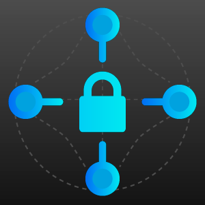

<p align="center">
  
</p>

DistributedLocks
====================
- Distributed Lockers Implementation for Distributed competing Nodes executing some action.
- Azure Storage Client.


[](https://opensource.org/licenses/MIT)
[](https://github.com/ellerbrock/open-source-badge/)
[](http://makeapullrequest.com)

|Build|Status|CodeFactor|
|------|-------------|-------------|
|master|[](https://ci.appveyor.com/project/davidrevoledo/distributedlocks)|[](https://www.codefactor.io/repository/github/davidrevoledo/distributedlocks/overview/master)
|dev|[](https://ci.appveyor.com/project/davidrevoledo/distributedlocks-ghway)|[](https://www.codefactor.io/repository/github/davidrevoledo/distributedlocks/overview/dev)

# Introduction
[CAP Theorem](https://en.wikipedia.org/wiki/CAP_theorem) is about distributed computing, always is convenient choosing availability over consistency, however there are some cases where consistency is a must.

Consider using a serverless solution to process messages from a queue, (simple implementation of [Queue-Worker-Pattern](https://docs.microsoft.com/en-us/azure/architecture/guide/architecture-styles/web-queue-worker)), let's say you are using Azure Functions for it. It is perfect because you can control your work load without rejecting operations but... what about if a your are editing user bank accounts and you should prevent other operation change the account until your process is complete, you want to still use a messaging-style arquitecture but in that point Consistency becomes more important that Availability.

Those scenarios are where this package comes to solve it providing strong-consistency in methods no matter if you are using a serverless approach or not.

Just block a call with a key (could be the account number in the example) and avoid other process executing any code blocked by your key, no matter in what machine process the code is being executed.

The usage is straight forward.

``` c#

// Process 1
IDistributedLock locker = await AzureStorageDistributedLock.CreateAsync(
            "a1239120391321", // account number
            options =>
            {
                options.ConnectionString = "Insert Storage Key here";
                options.Directory = "accountblocks";
            });
          
// Process a payment
await  locker.ExecuteAsync(async context =>
{
     BankAccount account = new BankAccount("a1239120391321")
     await account.ProcessPaymentAsync(500, "USD");
});
            
// Process 2
IDistributedLock locker = await AzureStorageDistributedLock.CreateAsync(
            "a1239120391321", // account number
            options =>
            {
                options.ConnectionString = "Insert Storage Key here";
                options.Directory = "accountblocks";
            });
            
// Process cash extraction
await  locker.ExecuteAsync(async context =>
{
     BankAccount account = new BankAccount("a1239120391321")
     // this will wait until the lock is released by the process 1
     await account.ProcessExtractionAsync(1000, "USD");
});

```

# Contents

1. [Features](#features)
2. [Installation](#installation)
3. [Usage](#usage)
4. [License](#license)

## <a name="features"> Features </a>

- Distributed Locks for competitor nodes process executing some action.
- Renew lease to get more time.
- Azure Storage Account implementation.
- AspNet Core middleware for easy usage.

====================

## <a name="installation"> Installation </a>

Grab the latest DistributedLock NuGet package and install in the desired package. https://www.nuget.org/packages/DistributedLocks/
```sh
PM > Install-Package DistributedLocks
NET CLI - dotnet add package DistributedLocks
paket add DistributedLocks
```

====================

## <a name="usage"> Usage </a>

``` c#

// Process 1
IDistributedLock locker = await AzureStorageDistributedLock.CreateAsync(
            "AnyKey", // account number
            options =>
            {
                options.ConnectionString = "Insert Storage Key here";
            });
          
await  locker.ExecuteAsync(async context =>
{
     await Task.Delay(1000); // execute some action here
});
           
```
#### Options 
``` c#
    locker = await AzureStorageDistributedLock.CreateAsync(
        "work",
        options =>
        {
            options.ConnectionString = storageKey; // azure storage account key
            options.Directory = "singlenode"; // directory where save checkpoints
            options.RetryTimes = 100; // intents until stop trying
            options.LeaseDuration = TimeSpan.FromSeconds(20); // lease duration in azure storage account is between 10 - 60 seconds
        });
```

#### Long Methods
If your method need more time to be executed the lease need be renewed, the control of when renew should be made by the program.
The Renewal time should be less than the Lease Duration.

``` c#
  private static Task DoHugeWork()
  {
      Console.WriteLine("Huge work launched");

      return locker.ExecuteAsync(async context =>
      {
          locker = await AzureStorageDistributedLock.CreateAsync(
            "longmethod",
            options =>
            {
                options.ConnectionString = storageKey;
                options.Directory = "leaserenewal";
                options.LeaseDuration = TimeSpan.FromSeconds(30);
            });
      
          Console.WriteLine("Huge work starting");

          // stage 1 - 15 seconds
          await Task.Delay(15000);
          var moreTime = await context.RenewLeaseAsync(TimeSpan.FromSeconds(20));
          if(!moreTime)
            RollbackOperation();
          
          Console.WriteLine("Getting more time to get the work done");

          // stage 2 - 15 seconds
          await Task.Delay(15000);
          moreTime = await context.RenewLeaseAsync(TimeSpan.FromSeconds(20));
          if(!moreTime)
            RollbackOperation();
          Console.WriteLine("Getting more time to get the work done");

          // stage 3 - 15 seconds
          await Task.Delay(15000);
          moreTime = await context.RenewLeaseAsync(TimeSpan.FromSeconds(20));
          if(!moreTime)
            RollbackOperation();
          Console.WriteLine("Getting more time to get the work done");

          // stage 4 - 15 seconds
          await Task.Delay(15000);

          Console.WriteLine("Huge work finished");
      });
  }
```

For more examples please check samples folder in the repo.

====================

[](http://forthebadge.com)

## <a name="license"> License </a>

MIT License
Copyright (c) 2019 David Revoledo

Permission is hereby granted, free of charge, to any person obtaining a copy
of this software and associated documentation files (the "Software"), to deal
in the Software without restriction, including without limitation the rights
to use, copy, modify, merge, publish, distribute, sublicense, and/or sell
copies of the Software, and to permit persons to whom the Software is
furnished to do so, subject to the following conditions:

The above copyright notice and this permission notice shall be included in all
copies or substantial portions of the Software.

THE SOFTWARE IS PROVIDED "AS IS", WITHOUT WARRANTY OF ANY KIND, EXPRESS OR
IMPLIED, INCLUDING BUT NOT LIMITED TO THE WARRANTIES OF MERCHANTABILITY,
FITNESS FOR A PARTICULAR PURPOSE AND NONINFRINGEMENT. IN NO EVENT SHALL THE
AUTHORS OR COPYRIGHT HOLDERS BE LIABLE FOR ANY CLAIM, DAMAGES OR OTHER
LIABILITY, WHETHER IN AN ACTION OF CONTRACT, TORT OR OTHERWISE, ARISING FROM,
OUT OF OR IN CONNECTION WITH THE SOFTWARE OR THE USE OR OTHER DEALINGS IN THE
SOFTWARE.

Made with ❤ in [DGENIX](https://www.dgenix.com/)

